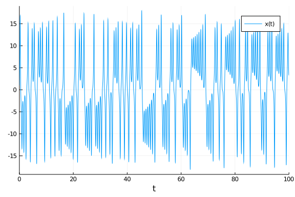
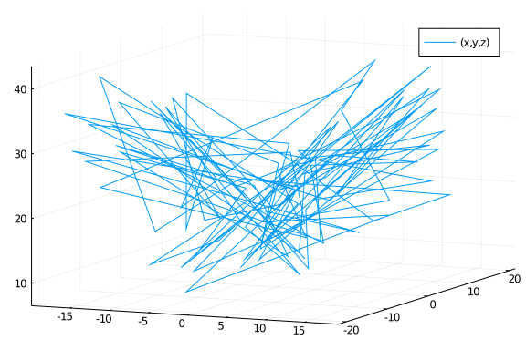
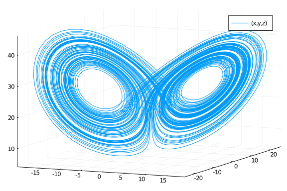
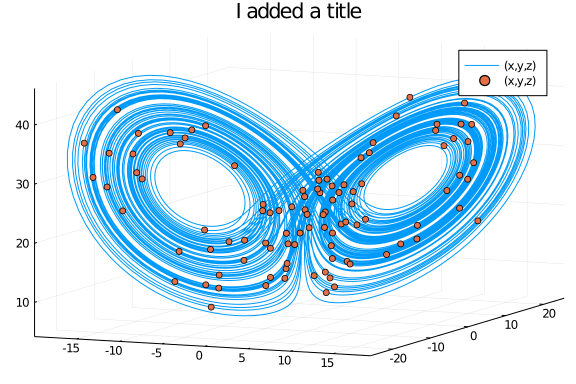

Since the plotting functionality is implemented as a recipe to Plots.jl, [all of the options open to Plots.jl can be used in our plots](https://juliaplots.github.io/supported/). In addition, there are special features specifically for [differential equation plots](https://docs.juliadiffeq.org/dev/basics/plot/). This tutorial will teach some of the most commonly used options. Let's first get the solution to some ODE. Here I will use one of the Lorenz ordinary differential equation. As with all commands in DifferentialEquations.jl, I got a plot of the solution by calling `solve` on the problem, and `plot` on the solution:

````julia
using DifferentialEquations, Plots, ParameterizedFunctions
gr()
lorenz = @ode_def Lorenz begin
  dx = σ*(y-x)
  dy = ρ*x-y-x*z
  dz = x*y-β*z
end σ β ρ

p = [10.0,8/3,28]
u0 = [1., 5., 10.]
tspan = (0., 100.)
prob = ODEProblem(lorenz, u0, tspan, p)
sol = solve(prob)
````


````
retcode: Success
Interpolation: Automatic order switching interpolation
t: 1341-element Array{Float64,1}:
   0.0
   0.0354861341350177
   0.060663987304508726
   0.10188870843348657
   0.1448498679508511
   0.19835698662820245
   0.2504996228815297
   0.3056774805827286
   0.35452829390108126
   0.40770996764610945
   ⋮
  99.40191484990574
  99.47703618501833
  99.5658234308723
  99.64807844262198
  99.72393302893481
  99.80148021054468
  99.87335069245553
  99.95168876649775
 100.0
u: 1341-element Array{Array{Float64,1},1}:
 [1.0, 5.0, 10.0]
 [2.3156522358261684, 5.897559436807755, 9.406792559102836]
 [3.237795350433643, 7.041031570475972, 9.233678311348145]
 [4.993868184294177, 9.832941470623643, 9.626109614367385]
 [7.42118455058636, 13.9492707343288, 11.582332131961147]
 [11.459763300544093, 19.75311392425321, 18.104295519177246]
 [15.47610807576506, 21.51087067675479, 29.88726710651812]
 [16.447464107891538, 13.124038426772515, 40.97121918674208]
 [12.877766779212395, 2.6188678957805847, 41.25247282418837]
 [7.136964977854118, -3.093417466070861, 35.505128642604284]
 ⋮
 [4.7078175125017845, 7.13104508677844, 18.651036529533698]
 [6.95971825488835, 10.593018553812076, 18.7863316112588]
 [10.646351699805901, 14.856180479322331, 23.998423289322353]
 [12.889615395081899, 13.273612975413583, 32.38413265349776]
 [11.146319066255193, 6.620076861975365, 34.91435700264157]
 [7.21823680615282, 2.4325891343715225, 31.07382292211859]
 [4.528555141302391, 1.9195182135779243, 26.403651898710038]
 [3.35872786591478, 2.855562241006029, 22.042971594934365]
 [3.3579402595045926, 3.829807498655525, 19.879219936458707]
````


````julia
plot(sol)
````


Now let's change it to a phase plot. As discussed in the [plot functions page](https://docs.juliadiffeq.org/dev/basics/plot/), we can use the `vars` command to choose the variables to plot. Let's plot variable `x` vs variable `y` vs variable `z`:

````julia
plot(sol,vars=(1, 2, 3))
````


We can also choose to plot the timeseries for a single variable:

````julia
plot(sol,vars=[:x])
````


Notice that we were able to use the variable names because we had defined the problem with the macro. But in general, we can use the indices. The previous plots would be:

````julia
plot(sol,vars=(1,2,3))
plot(sol,vars=[1])
````





Common options are to add titles, axis, and labels. For example:

````julia
plot(sol,linewidth=5,title="Solution to the linear ODE with a thick line",
xaxis="Time (t)",yaxis="u(t) (in mm)",label=["X","Y","Z"])
````


Notice that series recipes apply to the solution type as well. For example, we can use a scatter plot on the timeseries:

````julia
scatter(sol,vars=[:x])
````


This shows that the recipe is using the interpolation to smooth the plot. It becomes abundantly clear when we turn it off using `denseplot=false`:

````julia
plot(sol,vars=(1,2,3),denseplot=false)
````


When this is done, only the values the timestep hits are plotted. Using the interpolation usually results in a much nicer looking plot so it's recommended, and since the interpolations have similar orders to the numerical methods, their results are trustworthy on the full interval. We can control the number of points used in the interpolation's plot using the `plotdensity` command:

````julia
plot(sol,vars=(1,2,3),plotdensity=100)
````





That's plotting the entire solution using 100 points spaced evenly in time.

````julia
plot(sol,vars=(1,2,3),plotdensity=10000)
````





That's more like it! By default it uses `100*length(sol)`, where the length is the number of internal steps it had to take. This heuristic usually does well, but unusually difficult equations it can be relaxed (since it will take small steps), and for equations with events / discontinuities raising the plot density can help resolve the discontinuity.

Lastly notice that we can compose plots. Let's show where the 100 points are using a scatter plot:

````julia
plot(sol,vars=(1,2,3))
scatter!(sol,vars=(1,2,3),plotdensity=100)
````


We can instead work with an explicit plot object. This form can be better for building a complex plot in a loop.

````julia
p = plot(sol,vars=(1,2,3))
scatter!(p,sol,vars=(1,2,3),plotdensity=100)
title!("I added a title")
````





You can do all sorts of things. Have fun!


## Appendix

 This tutorial is part of the DiffEqTutorials.jl repository, found at: <https://github.com/JuliaDiffEq/DiffEqTutorials.jl>

To locally run this tutorial, do the following commands:
```
using DiffEqTutorials
DiffEqTutorials.weave_file("introduction","05-formatting_plots.jmd")
```

Computer Information:
```
Julia Version 1.4.2
Commit 44fa15b150* (2020-05-23 18:35 UTC)
Platform Info:
  OS: Linux (x86_64-pc-linux-gnu)
  CPU: Intel(R) Core(TM) i7-9700K CPU @ 3.60GHz
  WORD_SIZE: 64
  LIBM: libopenlibm
  LLVM: libLLVM-8.0.1 (ORCJIT, skylake)
Environment:
  JULIA_DEPOT_PATH = /builds/JuliaGPU/DiffEqTutorials.jl/.julia
  JULIA_CUDA_MEMORY_LIMIT = 536870912
  JULIA_PROJECT = @.
  JULIA_NUM_THREADS = 4

```

Package Information:

```
Status `/builds/JuliaGPU/DiffEqTutorials.jl/tutorials/introduction/Project.toml`
[6e4b80f9-dd63-53aa-95a3-0cdb28fa8baf] BenchmarkTools 0.5.0
[0c46a032-eb83-5123-abaf-570d42b7fbaa] DifferentialEquations 6.14.0
[65888b18-ceab-5e60-b2b9-181511a3b968] ParameterizedFunctions 5.3.0
[91a5bcdd-55d7-5caf-9e0b-520d859cae80] Plots 1.4.3
[90137ffa-7385-5640-81b9-e52037218182] StaticArrays 0.12.3
[c3572dad-4567-51f8-b174-8c6c989267f4] Sundials 4.2.3
[37e2e46d-f89d-539d-b4ee-838fcccc9c8e] LinearAlgebra
```
